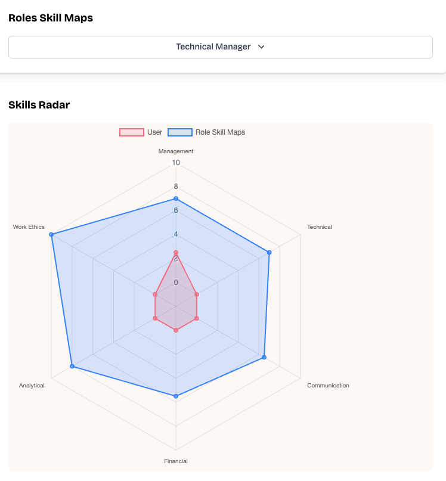
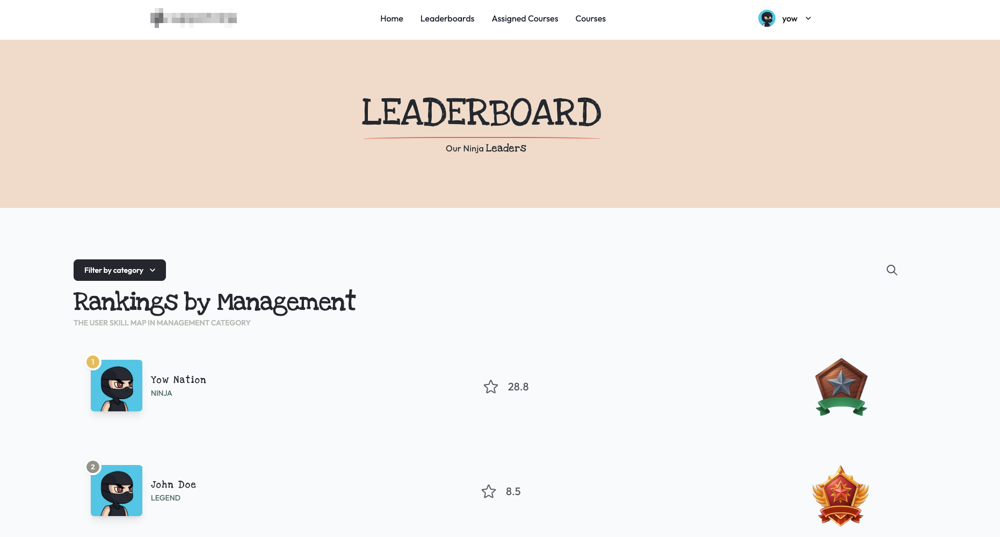
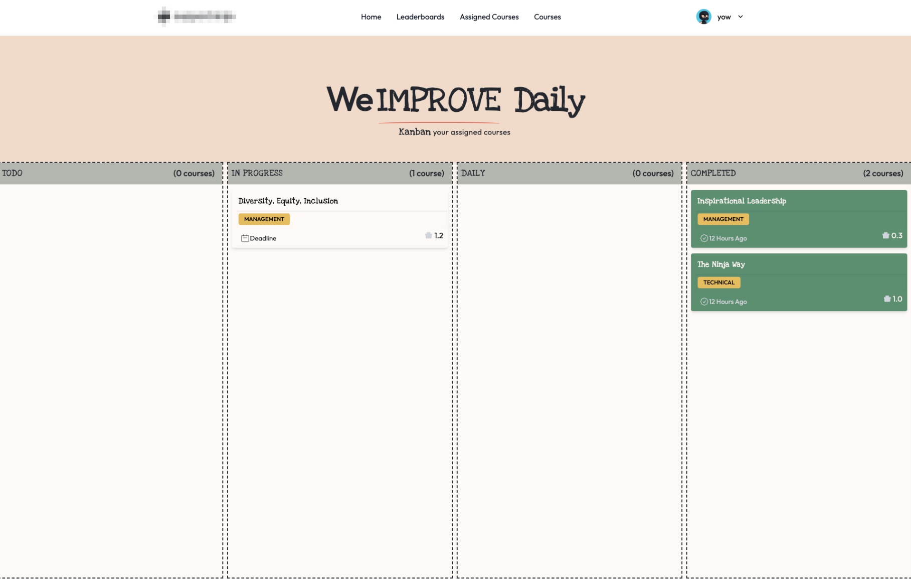
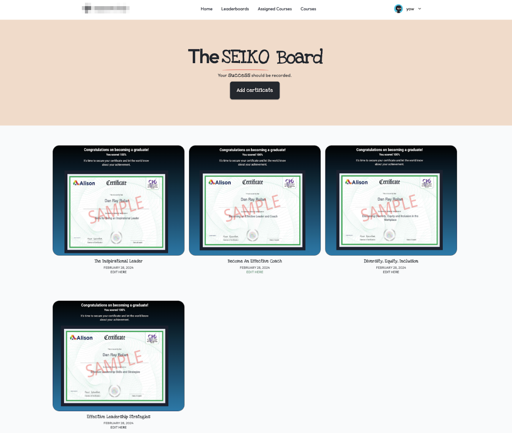
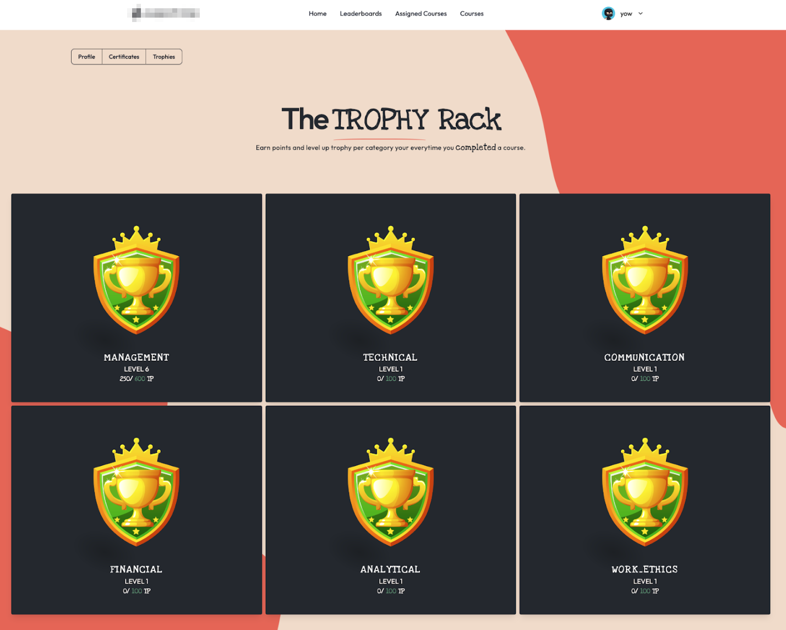

<a id="readme-top"></a>

NinjaBoard
==================

<!-- PROJECT LOGO -->
<br />
<div align="center">
<h3 align="center">NinjaBoard</h3>

  <p align="center">
    A Gamified Learning Management System and Dashboard
    <br />
      <strong>Explore the docs »</strong>
    <br />
    <br />
    <a href="https://youtu.be/ZSmCFUZnvMc">View Demo</a>
    ·
    <a href="https://github.com/danrayfr/NinjaBoard/issues">Report Bug</a>
    ·
    <a href="https://github.com/danrayfr/NinjaBoard/issues">Request Feature</a>
  </p>
</div>

<!-- TABLE OF CONTENTS -->
<details>
  <summary>Table of Contents</summary>
  <ol>
    <li>
      <a href="#about-the-project">About The Project</a>
      <ul>
        <li><a href="#built-with">Built With</a></li>
      </ul>
    </li>
    <li>
      <a href="#getting-started">Getting Started</a>
      <ul>
        <li><a href="#prerequisites">Prerequisites</a></li>
        <li><a href="#installation">Installation</a></li>
      </ul>
    </li>
    <li><a href="#usage">Usage</a></li>
    <li><a href="#roadmap">Roadmap</a></li>
    <li><a href="#contributing">Contributing</a></li>
    <li><a href="#license">License</a></li>
    <li><a href="#contact">Contact</a></li>
    <li><a href="#acknowledgments">Acknowledgments</a></li>
  </ol>
</details>


<!-- ABOUT THE PROJECT -->
## About The Project

[![Product Name Screen Shot][product-screenshot]](https://example.com)

NinjaBoard is a gamified learning management system and dashboard presented to
the Idea Program 2024, and won 1st Place. The goal of the project is to a
gamified the learning management system, and guide user's with their journey,
skills, and role development.

The following are the unique gamified features offered in the dashboard that may differentiate to a traditional:

<details>
  <summary>Features</summary>
  <ul>
    <li><a href="#skillMapping">Skill Mapping</li>
    <li><a href="#leaderboard">Leaderboard</li>
    <li><a href="#kanban">Kanban Board</li>
    <li><a href="#seiko">Rank & Badges</li>
    <li><a href="#">Seiko Board</li>
    <li><a href="#">Trophy Rack</li>
  <ul>
</details>







<p align="right">(<a href="#readme-top">back to top</a>)</p>

### Built With

* Ruby on Rails 7.1.3
* Ruby 3.3.0
* Tailwind CSS
* Stimulus JS

<p align="right">(<a href="#readme-top">back to top</a>)</p>


<!-- GETTING STARTED -->
## Getting Started

The following are the prerequisites and guides on how you can use this
project:

### Prerequisites

This project requires:

- Ruby 3.3.0, preferably managed using [rbenv] or [asdf][]
- Chromedriver for Capybara testing
- PostgreSQL must be installed and accepting connections
- [Redis][] must be installed and running on localhost with the default port

On a Mac, you can obtain all of the above packages using [Homebrew][].

If you need help setting up a Ruby development environment, check out this [Rails OS X Setup Guide](https://gorails.com/setup/macos/13-ventura), make sure you check the version of your device.

## Getting Started

To get started with the app, clone the repo and then install the needed gems:

```
$ gem install bundler -v 2.5.6
$ bundle _2.5.6_ config set --local without 'production'
$ bundle _2.5.6_ install
```

Create the database :

```
$ rails db:create
```

Next, migrate the database:

```
$ rails db:migrate

$ rails db:seed # optional
```

Finally, run the test suite to verify that everything is working correctly:

```
$ rails test
```

If the test suite passes, you'll be ready to run the app in a local server:

```
$ rails server or bin/dev
```

<p align="right">(<a href="#readme-top">back to top</a>)</p>


## Usage

You can use this project whenever you want, get the idea, and implement it to your own learning management system. I believe the features of this project has benefits and impacts to organization when use rightfully. You can copy all the code examples all you want, but leave the images, logos, brandings, etc. as those are owned by the artits, member of this project.

<p align="right">(<a href="#readme-top">back to top</a>)</p>

## License

Distributed under the MIT License.

MIT License

Copyright (c) 2024 Dan Ray Rollan

Credits to the Idea Program 2024 of SupportNinja Inc.

Permission is hereby granted, free of charge, to any person obtaining a copy
of this software and associated documentation files (the "Software"), to deal
in the Software without restriction, including without limitation the rights
to use, copy, modify, merge, publish, distribute, sublicense, and/or sell
copies of the Software, and to permit persons to whom the Software is
furnished to do so, subject to the following conditions:

The above copyright notice and this permission notice shall be included in all
copies or substantial portions of the Software.

THE SOFTWARE IS PROVIDED "AS IS", WITHOUT WARRANTY OF ANY KIND, EXPRESS OR
IMPLIED, INCLUDING BUT NOT LIMITED TO THE WARRANTIES OF MERCHANTABILITY,
FITNESS FOR A PARTICULAR PURPOSE AND NONINFRINGEMENT. IN NO EVENT SHALL THE
AUTHORS OR COPYRIGHT HOLDERS BE LIABLE FOR ANY CLAIM, DAMAGES OR OTHER
LIABILITY, WHETHER IN AN ACTION OF CONTRACT, TORT OR OTHERWISE, ARISING FROM,
OUT OF OR IN CONNECTION WITH THE SOFTWARE OR THE USE OR OTHER DEALINGS IN THE
SOFTWARE.

<p align="right">(<a href="#readme-top">back to top</a>)</p>

## Contact

Dan Ray Rollan - [@instagram/danrayfr](https://www.instagram.com/danray_fr/) - danrayrollan98@gmail.com

Github Profile: [https://github.com/danrayfr/](https://github.com/danrayfr/)

<p align="right">(<a href="#readme-top">back to top</a>)</p>

<!-- ACKNOWLEDGMENTS -->
## Acknowledgments

Many thanks to the following:

* The Idea Program 2024 of SupportNinja Inc.

<p align="right">(<a href="#readme-top">back to top</a>)</p>

<!-- MARKDOWN LINKS & IMAGES -->
[product-screenshot]: ./app/assets/images/documentations/homepage.png
